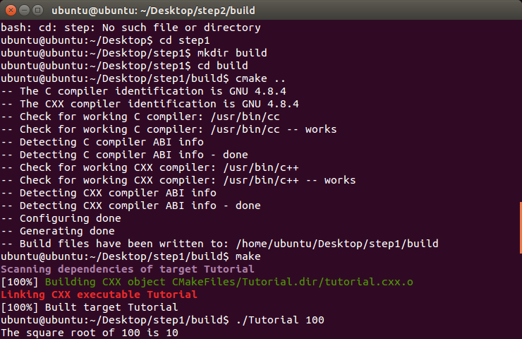
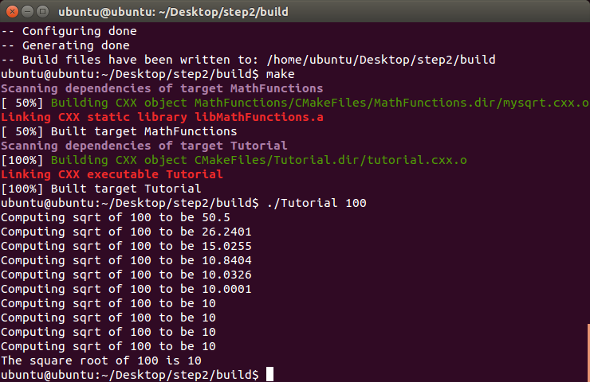
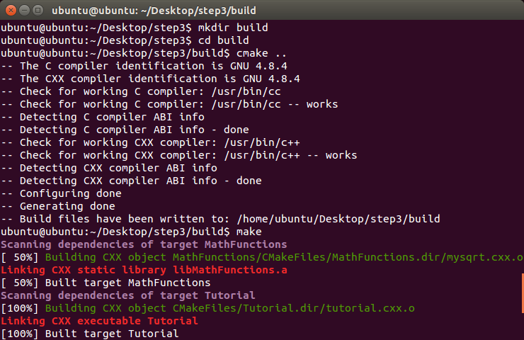
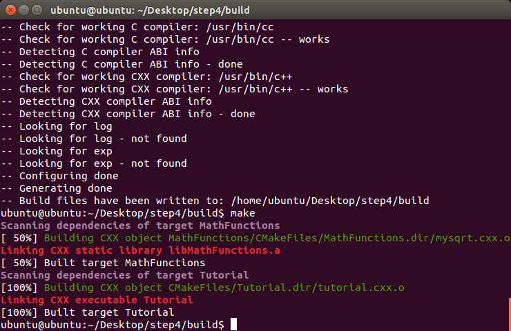
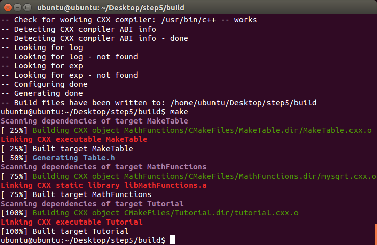

<ul>
	<li>[step 1](./master/step1)</li>
	<li></li>
	<li>[step 2](./master/step2)</li>
	<li></li>
	<li>[step 3](./master/step3)</li>
	<li></li>
	<li>[step 4](./master/step4)</li>
	<li></li>
	<li>[step 5](./master/step5)</li>
	<li></li>
</ul>

